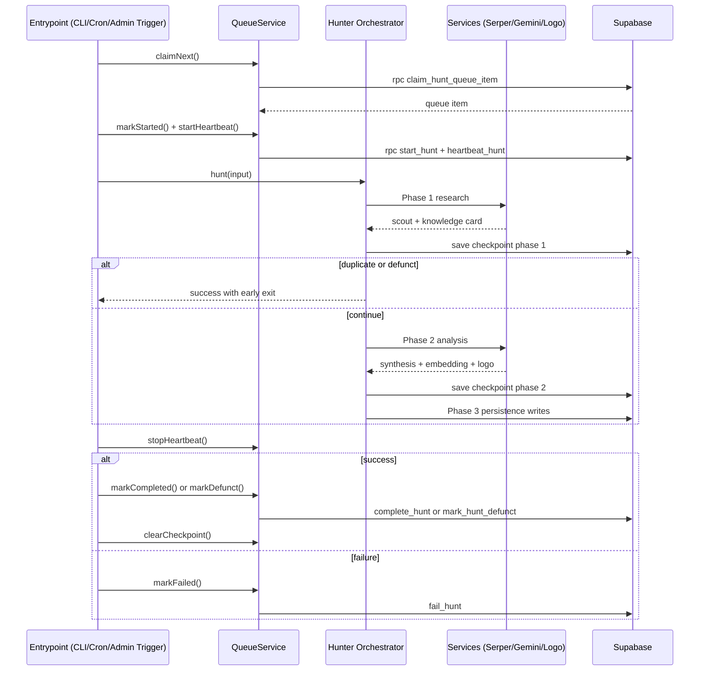
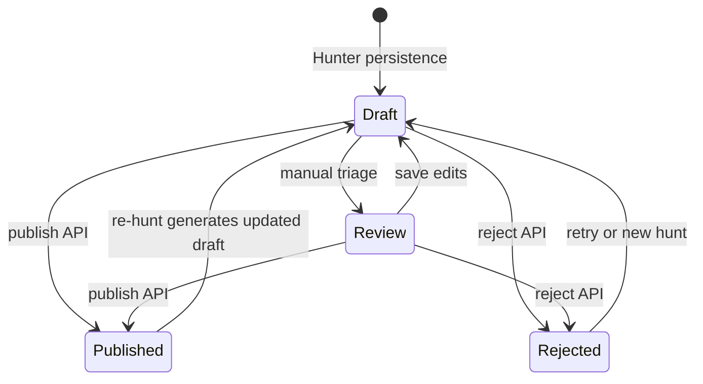

# StackHunt Flow Diagrams

Last verified: 2026-03-05

This file maps the current end-to-end flows in StackHunt from code entrypoints.

## 1) System-Wide Flow (All Major Flows)

```mermaid
flowchart TB
  U[User or Admin Browser] --> MW[src/middleware.ts]
  MW -->|/admin or /api/admin| AUTH[Session + CSRF validation]
  MW -->|public routes| PUB[Public page rendering]

  subgraph Admin["Admin Console"]
    A1[/admin/login + /api/admin/login]
    A2[/admin/create + /api/admin/hunt]
    A3[/admin/strategy + content ideas APIs]
    A4[/admin/queue + hunt queue APIs]
    A5[/admin/review + review APIs]
    A6[/api/admin/hunt-queue/trigger]
  end

  AUTH --> A1
  AUTH --> A2
  AUTH --> A3
  AUTH --> A4
  AUTH --> A5
  AUTH --> A6

  subgraph Strategy["Strategy and Idea Intake"]
    S1[/api/admin/content-ideas/import]
    S2[content_ideas table]
    S3[/api/admin/strategy/analyze RPC analyze_content_ideas]
    S4[/api/admin/strategy/approve RPC bulk_approve_ideas]
  end

  A3 --> S1 --> S2
  S2 --> S3 --> S2
  S2 --> S4 --> HQ[(hunt_queue table)]
  S1 -->|priority >= 90| HQ

  subgraph QueueEntry["Direct Queue Entry"]
    Q1[/api/admin/hunt]
    Q2[/api/admin/queue/add]
    Q3[scripts/hunter.ts --queue add]
    Q4[/api/feedback auto-QA trigger]
    Q5[/api/verify-price RPC record_price_verification]
    Q6[/api/cron/pricing-refresh RPC enqueue_pricing_refresh]
    Q7[/api/cron/discover-topics]
  end

  A2 --> Q1 --> HQ
  A4 --> Q2 --> HQ
  Q3 --> HQ
  Q4 --> HQ
  Q5 --> HQ
  Q6 --> HQ
  Q7 --> S2

  subgraph Workers["Queue Processing Entrypoints"]
    W1[scripts/queue-worker.ts]
    W2[scripts/hunter.ts --queue process or batch]
    W3[/api/cron/hunt]
    W4[/api/admin/hunt-queue/trigger]
  end

  HQ --> W1
  HQ --> W2
  HQ --> W3
  HQ --> W4

  subgraph Hunter["Hunter Orchestrator src/lib/hunter/orchestrator.ts"]
    H0[claimNext + markStarted + heartbeat]
    H1[Phase 1 Research]
    H2{Early exits}
    H3[Phase 2 Analysis]
    H4[Phase 3 Persistence]
    H5[markCompleted or markFailed or markDefunct]
  end

  W1 --> H0
  W2 --> H0
  W3 --> H0
  W4 --> H0

  H0 --> H1 --> H2
  H2 -->|duplicate or defunct| H5
  H2 -->|insufficient sources or research-only| H4
  H2 -->|continue| H3 --> H4 --> H5

  subgraph DataPlane["Data and External Services"]
    D1[(Supabase DB)]
    D2[SerperService]
    D3[GeminiService]
    D4[LogoService]
    D5[ModelInventoryService]
  end

  H1 --> D2
  H1 --> D3
  H3 --> D3
  H3 --> D4
  H3 --> D5
  H4 --> D1
  HQ --> D1
  S2 --> D1

  subgraph ReviewLoop["Editorial Review Lifecycle"]
    R1[draft or review status]
    R2[/api/admin/review/[id]/update]
    R3[/api/admin/review/[id]/publish]
    R4[/api/admin/review/[id]/reject]
    R5[published or rejected]
  end

  A5 --> R1
  R1 --> R2 --> R1
  R1 --> R3 --> R5
  R1 --> R4 --> R5

  subgraph PublicRead["Public Experience"]
    P1[/best/[slug]]
    P2[/tool/[slug]]
    P3[/compare/[...slugs]]
    P4[/api/signals/record]
    P5[/api/corrections]
    P6[/api/feedback]
  end

  PUB --> P1
  PUB --> P2
  PUB --> P3
  PUB --> P4
  PUB --> P5
  PUB --> P6

  P1 --> D1
  P2 --> D1
  P3 --> D1
  P4 --> D1
  P5 --> D1
  P6 --> D1
```

## 2) Queue + Hunter Sequence



## 3) Review State Lifecycle


