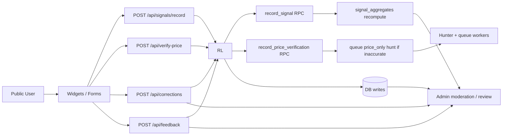

# Trust Events Architecture (End-to-End)

Last verified: 2026-03-05

Last updated: February 20, 2026

This document summarizes StackHunt's public trust-event system:
- thumbs feedback (review helpfulness)
- community signals
- price verification
- corrections and feedback

It covers the data path from UI to moderation outcomes, anti-abuse controls, and operational checks.

## 1) System Boundaries

### Public entry points
- `POST /api/signals/record`
- `POST /api/verify-price`
- `POST /api/corrections`
- `POST /api/feedback`

### Internal consumers
- Admin review/moderation UIs (`/admin/*`)
- Queue workers (`scripts/queue-worker.ts`, hunter pipeline)
- Cron and scheduled quality checks

### Core DB entities
- `reviews`
- `user_signals`
- `signal_aggregates`
- `price_verifications`
- `corrections`
- `user_feedback`
- `hunt_queue`

## 2) End-to-End Flow

## 3) Per-Path Behavior

## 3.1 Thumbs Feedback (review helpfulness)
- UI: `src/components/VoteWidget.tsx`
- API: `src/pages/api/signals/record.ts`
- RPC: `record_signal(uuid, text, text, boolean, text, numeric, text, text, text, text)`
- Signal key: `review_helpful`
- Storage: `user_signals`
- Read model: `signal_aggregates` (`yes` / `no` options)

### Abuse controls
- endpoint-level rate limit
- DB-atomic upsert semantics (one actor per `(item_id, signal_id)`)
- hashed identifiers (privacy-preserving)

### Moderation impact
- thumbs feedback contributes to trust/reader feedback signals through structured aggregates
- can be analyzed alongside tool-level community signals in a single pipeline

## 3.2 Community Signals (tool-level structured feedback)
- UI: `src/components/SignalReportWidget.tsx`
- API: `src/pages/api/signals/record.ts`
- RPC: `record_signal(uuid, text, text, boolean, text, numeric, text, text, text, text)`
- Storage: `user_signals`
- Read model: `signal_aggregates`

### Abuse controls
- endpoint-level rate limit
- DB-atomic upsert semantics (one actor per `(item_id, signal_id)`)
- actor identity key: fingerprint hash first, IP hash fallback
- deterministic risk tracking on each event:
  - `risk_score`
  - `risk_reasons[]` (e.g., `ip_only_actor_key`, `velocity_spike_actor`, `velocity_spike_ip`, `fingerprint_churn`)

### Moderation impact
- aggregate counts displayed to users
- raw events are auditable for manual analysis/moderation

## 3.3 Price Verification (tool-level freshness signal)
- UI: `src/components/PriceVerification.tsx`
- API: `src/pages/api/verify-price.ts`
- RPC: `record_price_verification(uuid, text, boolean, text, text, boolean, text, text, text)`
- Storage: `price_verifications`

### Abuse controls
- endpoint-level rate limit
- actor dedupe window (one verification per actor+item over rolling window)
- deterministic risk tracking:
  - `missing_turnstile`
  - `ip_only_actor_key`
  - `velocity_spike_actor`
  - `velocity_spike_ip`
  - `fingerprint_churn`
  - `origin_mismatch`
- stores `risk_score` and `risk_reasons[]` for explainable moderation

### Moderation/ops impact
- accurate reports increment confidence counters (`items.user_verifications_this_week`)
- inaccurate reports auto-enqueue `price_only` refresh in `hunt_queue` (deduped against active queue rows)

## 3.4 Corrections
- API: `src/pages/api/corrections.ts`
- Storage: `corrections`
- Includes honeypot field (`company_name`) and rate limiting

### Moderation impact
- correction volume and confirmed corrections can trigger quality review pathways
- review team resolves / applies corrections through admin workflows

## 3.5 General Feedback
- API: `src/pages/api/feedback.ts`
- Storage: `user_feedback`

### Moderation impact
- threshold logic can enqueue QA refresh jobs
- currently less integrated than corrections/signals in admin UX

## 4) Deterministic Risk Scoring Model

Design goal: simple, reproducible, moderation-friendly.

Each event gets:
- `risk_score` (0-100, clamped)
- `risk_reasons[]` (explicit reason codes)

Reason codes are additive and rule-based (no ML model), making decisions explainable in review tooling and audits.

## 5) Security and Integrity Patterns

- DB RPCs as trust boundaries for mutation-heavy paths
- `SECURITY DEFINER` functions with explicit `search_path`
- endpoint rate limiting via `check_rate_limit` RPC
- hashed actor identifiers for privacy
- DB-level uniqueness where correctness matters (signals actor uniqueness)
- queue dedupe checks before auto-enqueue operations

## 6) CI / Drift Prevention

- `scripts/check-rpc-signatures.mjs`
- `scripts/rpc-signatures.expected.json`
- `npm run qa:rpc` (included in `qa:prepush`)

Purpose:
- fail fast when app code expects RPCs that are missing from migrations
- keep runtime API behavior aligned with schema versioning

## 7) Known Gaps / Next Hardening

1. Feedback path consistency:
- `user_feedback` path should be either fully integrated into moderation UX or merged with corrections/events pipeline.

2. Turnstile coverage:
- no longer used on the thumbs feedback path (structured signals); evaluate whether selected public write endpoints need added challenge coverage based on observed abuse.

3. Vote migration deployment status:
- legacy vote path has been deprecated in favor of structured `review_helpful` signals; historical vote hardening migrations remain in migration history only.

## 8) Recommended Evolution Path

1. Expand structured feedback semantics (including optional unset/toggle behavior) without reintroducing a parallel vote pipeline.
2. Unify trust-event reason codes and risk display in admin.
3. Normalize feedback/corrections into one moderation queue surface.
4. Refactor toward a formal "trust events layer" after behavior stabilizes.
